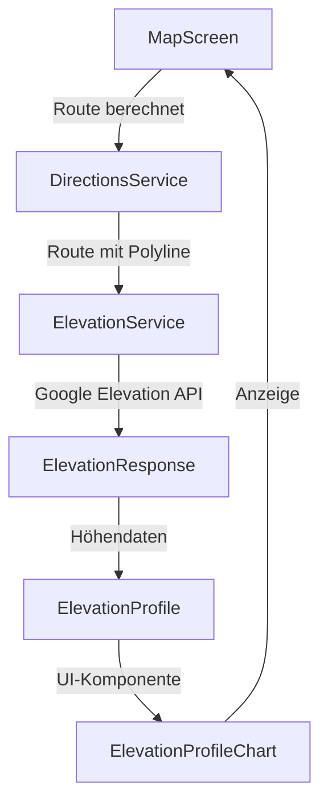

# DEM/Höhenmodelle Implementierung

## Übersicht

Integration der Google Elevation API zur automatischen Berechnung und grafischen Darstellung von Höhenprofilen entlang von Routen. Die Höhendaten werden automatisch bei jeder Routenberechnung abgerufen und als interaktives Höhenprofil angezeigt.

## Architektur

## Implementierungsschritte

### 1. Elevation API Service erstellen

**Datei**: `app/src/main/java/com/example/kuladig_app/data/service/ElevationService.kt`

- Neuer Service-Klasse ähnlich wie `DirectionsService`
- Verwendet denselben API-Key aus dem Manifest
- Retrofit-Interface für Google Elevation API
- Methode `getElevationAlongPath()` für Höhendaten entlang einer Polyline
- Methode `getElevationForLocations()` für einzelne Koordinaten

**API-Endpoint**: `https://maps.googleapis.com/maps/api/elevation/json`

**Wichtig**: Google Elevation API unterstützt max. 512 Koordinaten pro Request. Für längere Routen müssen mehrere Requests gemacht werden.

### 2. Elevation API Interface definieren

**Datei**: `app/src/main/java/com/example/kuladig_app/data/service/ElevationApi.kt`

- Retrofit-Interface für Elevation API
- Endpoints für `path` (Polyline) und `locations` (Einzelpunkte)
- Response-Modelle definieren

### 3. Elevation Datenmodelle erweitern

**Datei**: `app/src/main/java/com/example/kuladig_app/data/model/Elevation.kt` (neu)

- `ElevationResponse` - API Response
- `ElevationResult` - Einzelnes Höhenresultat
- `ElevationProfile` - Verarbeitetes Höhenprofil mit min/max/Anstieg
- `ElevationPoint` - Punkt mit Koordinate und Höhe

### 4. Route-Modell erweitern

**Datei**: `app/src/main/java/com/example/kuladig_app/data/model/Route.kt`

- Optionales Feld `elevationProfile: ElevationProfile?` hinzufügen
- Ermöglicht Speicherung der Höhendaten mit der Route

### 5. DirectionsService Integration

**Datei**: `app/src/main/java/com/example/kuladig_app/data/service/DirectionsService.kt`

- ElevationService als Dependency injizieren
- Optionale Methode `getRouteWithElevation()` die Route + Höhendaten zurückgibt
- Automatische Höhendatenberechnung nach Routenberechnung

### 6. ElevationProfileChart UI-Komponente

**Datei**: `app/src/main/java/com/example/kuladig_app/ui/components/ElevationProfileChart.kt` (neu)

- Compose-Komponente für grafische Darstellung des Höhenprofils
- Verwendet `Canvas` oder `androidx.compose.ui.graphics.Path` für Zeichnung
- Zeigt:
  - X-Achse: Distanz entlang der Route
  - Y-Achse: Höhe in Metern
  - Linie mit Höhenverlauf
  - Min/Max-Höhe markieren
  - Gesamtanstieg/Abstieg anzeigen
- Interaktiv: Zeigt Höhe bei Berührung bestimmter Positionen

### 7. MapScreen Integration

**Datei**: `app/src/main/java/com/example/kuladig_app/ui/screens/MapScreen.kt`

- ElevationService initialisieren (ähnlich wie DirectionsService)
- Nach erfolgreicher Routenberechnung automatisch Höhendaten abrufen
- ElevationProfile in State speichern
- ElevationProfileChart in Route-Info-Card einbinden
- Erweiterte Route-Info mit Höhenstatistiken (min/max/Anstieg)

### 8. Höhendaten-Optimierung

- Sampling-Strategie: Nicht alle Polyline-Punkte verwenden, sondern intelligente Stichproben
- Caching: Höhendaten für bereits berechnete Routen cachen
- Fehlerbehandlung: Graceful Degradation wenn Elevation API fehlschlägt

## Technische Details

### Google Elevation API

- **Base URL**: `https://maps.googleapis.com/maps/api/elevation/json`
- **Path-Methode**: Höhendaten entlang einer Polyline (max. 512 Punkte)
- **Locations-Methode**: Höhendaten für einzelne Koordinaten (max. 512 Punkte)
- **API-Key**: Verwendet denselben Key wie Directions API
- **Rate Limits**: Beachten der Google API Quotas

### Sampling-Strategie

Für Routen mit >512 Punkten:

1. Route in Segmente aufteilen
2. Pro Segment repräsentative Punkte wählen
3. Mehrere API-Requests machen
4. Ergebnisse zusammenführen

### UI-Design

- Höhenprofil als erweiterbarer Bereich in Route-Info-Card
- Standardmäßig eingeklappt, kann aufgeklappt werden
- Kompakte Statistik (min/max/Anstieg) immer sichtbar
- Vollständiges Profil bei Aufklappen

## Dependencies

Keine zusätzlichen Dependencies erforderlich - verwendet bereits vorhandene:

- Retrofit (bereits vorhanden)
- Kotlinx Serialization (bereits vorhanden)
- OkHttp (bereits vorhanden)
- Compose Canvas/Graphics (bereits in Compose enthalten)

## Dateien die erstellt/geändert werden

**Neu erstellt:**

- `app/src/main/java/com/example/kuladig_app/data/service/ElevationService.kt`
- `app/src/main/java/com/example/kuladig_app/data/service/ElevationApi.kt`
- `app/src/main/java/com/example/kuladig_app/data/model/Elevation.kt`
- `app/src/main/java/com/example/kuladig_app/ui/components/ElevationProfileChart.kt`

**Geändert:**

- `app/src/main/java/com/example/kuladig_app/data/model/Route.kt` - Optionales elevationProfile Feld
- `app/src/main/java/com/example/kuladig_app/data/service/DirectionsService.kt` - Integration ElevationService
- `app/src/main/java/com/example/kuladig_app/ui/screens/MapScreen.kt` - Elevation-Berechnung und UI-Integration