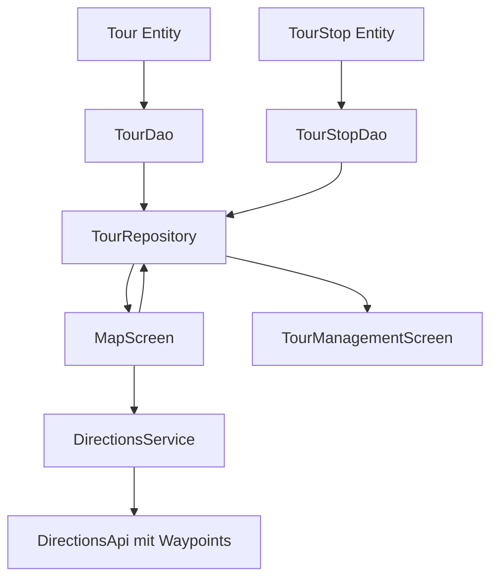

# Tour-Stopps Implementierung

## Übersicht

Implementierung eines vollständigen Tour-Stopp-Systems, das es Benutzern ermöglicht, mehrere Sehenswürdigkeiten zu einer Tour zusammenzufassen, diese zu speichern, zu verwalten und Routen mit mehreren Zwischenstopps zu berechnen.

## Architektur

## Implementierungsschritte

### 1. Datenmodelle erstellen

**Datei**: `app/src/main/java/com/example/kuladig_app/data/model/Tour.kt`

- `Tour` Entity mit Room-Annotationen:
  - `id: Long` (PrimaryKey, autoGenerate)
  - `name: String`
  - `description: String?`
  - `createdAt: Long` (Timestamp)
  - `travelMode: TravelMode`
- `TourStop` Entity:
  - `id: Long` (PrimaryKey, autoGenerate)
  - `tourId: Long` (Foreign Key zu Tour)
  - `kuladigObjectId: String` (Foreign Key zu KuladigObject)
  - `stopOrder: Int` (Reihenfolge in der Tour)
  - `notes: String?` (optionale Notizen)

**Referenz**: [app/src/main/java/com/example/kuladig_app/data/model/KuladigObject.kt](app/src/main/java/com/example/kuladig_app/data/model/KuladigObject.kt) - ähnliche Entity-Struktur

### 2. Room DAOs erstellen

**Datei**: `app/src/main/java/com/example/kuladig_app/data/dao/TourDao.kt`

- `getAll()`: Alle Tours laden
- `getById(id: Long)`: Tour mit Stopps laden
- `insert(tour: Tour)`: Tour speichern
- `update(tour: Tour)`: Tour aktualisieren
- `delete(tour: Tour)`: Tour löschen

**Datei**: `app/src/main/java/com/example/kuladig_app/data/dao/TourStopDao.kt`

- `getStopsByTourId(tourId: Long)`: Alle Stopps einer Tour (sortiert nach stopOrder)
- `insert(stop: TourStop)`: Stopp speichern
- `insertAll(stops: List<TourStop>)`: Mehrere Stopps speichern
- `deleteByTourId(tourId: Long)`: Alle Stopps einer Tour löschen
- `update(stop: TourStop)`: Stopp aktualisieren

**Referenz**: [app/src/main/java/com/example/kuladig_app/data/dao/KuladigDao.kt](app/src/main/java/com/example/kuladig_app/data/dao/KuladigDao.kt) - ähnliche DAO-Struktur

### 3. Datenbank erweitern

**Datei**: `app/src/main/java/com/example/kuladig_app/data/database/KuladigDatabase.kt`

- Entities hinzufügen: `Tour::class`, `TourStop::class`
- Version erhöhen: `version = 3`
- DAOs hinzufügen: `abstract fun tourDao(): TourDao`, `abstract fun tourStopDao(): TourStopDao`

**Referenz**: [app/src/main/java/com/example/kuladig_app/data/database/KuladigDatabase.kt](app/src/main/java/com/example/kuladig_app/data/database/KuladigDatabase.kt) - aktuelle Struktur

### 4. Repository erweitern

**Datei**: `app/src/main/java/com/example/kuladig_app/data/repository/KuladigRepository.kt`

- Tour-Methoden hinzufügen:
  - `getAllTours()`
  - `getTourWithStops(tourId: Long)`
  - `insertTour(tour: Tour, stops: List<TourStop>)`
  - `updateTour(tour: Tour, stops: List<TourStop>)`
  - `deleteTour(tourId: Long)`

**Referenz**: [app/src/main/java/com/example/kuladig_app/data/repository/KuladigRepository.kt](app/src/main/java/com/example/kuladig_app/data/repository/KuladigRepository.kt) - Repository-Pattern

### 5. Directions API erweitern

**Datei**: `app/src/main/java/com/example/kuladig_app/data/service/DirectionsApi.kt`

- Neue Methode `getDirectionsWithWaypoints()` hinzufügen:
  - `@Query("waypoints") waypoints: String` Parameter
  - Waypoints als pipe-separated String: `"lat1,lng1|lat2,lng2|..."`

**Datei**: `app/src/main/java/com/example/kuladig_app/data/service/DirectionsService.kt`

- Neue Methode `getRouteWithWaypoints()`:
  - Parameter: `origin: LatLng`, `waypoints: List<LatLng>`, `destination: LatLng`, `mode: TravelMode`
  - Waypoints zu String formatieren
  - API aufrufen mit Waypoints
  - Route zurückgeben

**Referenz**: [app/src/main/java/com/example/kuladig_app/data/service/DirectionsService.kt](app/src/main/java/com/example/kuladig_app/data/service/DirectionsService.kt:48-71) - aktuelle getRoute-Methode

### 6. Tour-Management-Screen erstellen

**Datei**: `app/src/main/java/com/example/kuladig_app/ui/screens/TourManagementScreen.kt`

- Liste aller gespeicherten Tours
- Tour erstellen/bearbeiten/löschen
- Tour-Stopps hinzufügen/entfernen/neu sortieren (Drag & Drop)
- Tour starten (Navigation zu MapScreen)

**UI-Komponenten**:

- Tour-Liste mit Card-Layout
- FAB zum Erstellen neuer Tours
- Bottom Sheet/Dialog für Tour-Details
- Reorderable Liste für Stopps

### 7. Tour-Erstellung-UI

**Datei**: `app/src/main/java/com/example/kuladig_app/ui/components/TourEditorBottomSheet.kt`

- Tour-Name und Beschreibung eingeben
- Stopps aus KuladigObjects auswählen
- Stopp-Reihenfolge ändern (Drag & Drop oder Pfeile)
- Transportmodus wählen
- Speichern/Abbrechen

### 8. MapScreen erweitern

**Datei**: `app/src/main/java/com/example/kuladig_app/ui/screens/MapScreen.kt`

- Tour-Parameter akzeptieren: `initialTour: Tour?`
- Multi-Waypoint-Route berechnen wenn Tour übergeben wird
- Tour-Stopps als Marker anzeigen (nummeriert)
- Aktuellen Stopp hervorheben
- Navigation zwischen Stopps ermöglichen

**Erweiterungen**:

- `calculateTourRoute()` Methode für Multi-Waypoint-Routen
- Tour-Stopp-Marker mit Nummern
- Route-Polyline für gesamte Tour
- UI für Tour-Navigation (vorheriger/nächster Stopp)

**Referenz**: [app/src/main/java/com/example/kuladig_app/ui/screens/MapScreen.kt](app/src/main/java/com/example/kuladig_app/ui/screens/MapScreen.kt:230-278) - aktuelle Routenberechnung

### 9. MarkerInfoBottomSheet erweitern

**Datei**: `app/src/main/java/com/example/kuladig_app/ui/components/MarkerInfoBottomSheet.kt`

- Button "Zu Tour hinzufügen" hinzufügen
- Dialog für Tour-Auswahl (wenn mehrere Tours existieren)
- Stopp zur ausgewählten Tour hinzufügen

**Referenz**: [app/src/main/java/com/example/kuladig_app/ui/components/MarkerInfoBottomSheet.kt](app/src/main/java/com/example/kuladig_app/ui/components/MarkerInfoBottomSheet.kt) - aktuelle Struktur

### 10. Navigation erweitern

**Datei**: `app/src/main/java/com/example/kuladig_app/MainActivity.kt`

- TourManagementScreen zur Navigation hinzufügen
- Navigation von TourManagementScreen zu MapScreen mit Tour-Parameter
- Optional: Tour-Management als neues AppDestinations-Element

**Referenz**: [app/src/main/java/com/example/kuladig_app/MainActivity.kt](app/src/main/java/com/example/kuladig_app/MainActivity.kt:52-128) - aktuelle Navigation

## Technische Details

### Google Directions API Waypoints

- Maximal 25 Waypoints pro Route (Google API Limit)
- Waypoints werden als Zwischenstopps behandelt
- Optimierung: `optimize:true` Parameter für automatische Reihenfolge-Optimierung (optional)

### Datenbank-Migration

- Room Migration von Version 2 zu 3 erforderlich
- Neue Tabellen: `tours`, `tour_stops`
- Foreign Keys zu `kuladig_objects` Tabelle

### UI/UX Überlegungen

- Drag & Drop für Stopp-Reihenfolge (Compose Reorderable)
- Visuelle Unterscheidung zwischen Tour-Stopps und normalen Markern
- Tour-Progress-Anzeige (z.B. "Stopp 2 von 5")
- Möglichkeit, Tour während Navigation zu bearbeiten

## Abhängigkeiten

Keine neuen Dependencies erforderlich. Alle benötigten Bibliotheken sind bereits vorhanden:

- Room Database ✅
- Compose UI ✅
- Google Maps SDK ✅
- Retrofit ✅

## Testfälle

1. Tour erstellen mit mehreren Stopps
2. Tour speichern und aus Datenbank laden
3. Multi-Waypoint-Route berechnen
4. Tour-Stopps in korrekter Reihenfolge anzeigen
5. Tour bearbeiten (Stopps hinzufügen/entfernen/neu sortieren)
6. Tour löschen
7. Tour von MapScreen starten